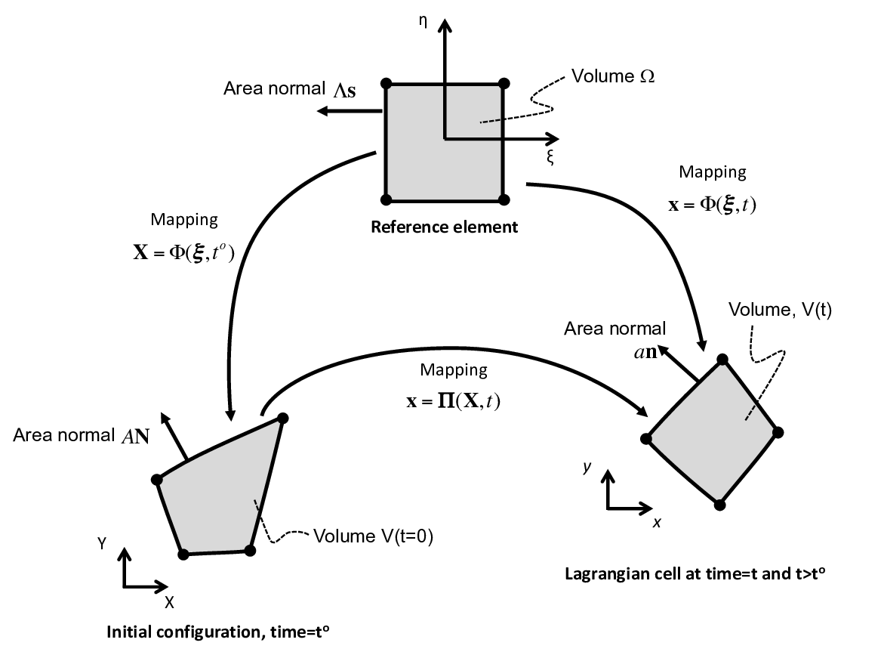

# SGH-3D Solver

The SGH-3D solver is a lumped-mass conservative Lagrangian finite element hydrodynamic method designed to solve governing equations for compressible material dynamics involving diverse materials.

## Governing Equations

The solver addresses the conservation of mass, momentum, and specific internal energy:

### Mass Conservation
The density for each material is calculated using strong mass conservation. Since a single quadrature point element is used, the density for the element at any time is given by:

$$
\rho^m_h = \frac{m^m_h}{V^m_h}
$$

where $m^m_h$ is the element average mass for a material and $V^m_h$ is the volume of a material in an element.

### Momentum Evolution
The Galerkin approach multiplies the governing equations by a test function (basis functions $\phi_q$), creating a system of equations for calculating nodal velocities:

$$
\sum \limits_{p} \mathbf{M}_{qp} \frac{d \mathbf{v}_p}{dt} = - \sum \limits_{h \ni q} \sum \limits_{m \in h} \int \limits_{V_h} \left(\nabla {\phi_q} \right) \cdot ( \boldsymbol{\sigma}_h^m + \mathbf{Q}_h^m) \beta_h^m \theta_h^m d V
$$

where $\mathbf{M}_{qp}$ is a global sparse mass matrix (lumped).

### Specific Internal Energy Evolution
The specific internal energy evolution equation guarantees total energy conservation (compatible discretization). The change in specific internal energy for an element is given by:

$$
{e}_h^{m,\, n+1} = {e}_h^{m,\, n} - \frac{\Delta t}{m^m_h} \sum \limits_{p \in h} \left( { \mathbf{F}^{m, \,n+1/2}_{hp}}\cdot \frac{1}{2}\left(\mathbf{v}_p^{n+1} + \mathbf{v}_p^{n} \right) \right)
$$

## Numerical Methods

### Geometry
Position and velocity fields are defined in terms of Lagrangian basis functions:

$$
\mathbf{x}_h({\boldsymbol  \xi},t) = \sum \limits_{p \in h} {\phi}_p \left( {\boldsymbol  \xi} \right) \cdot \mathbf{x}_p \left( t \right)
$$

$$
\mathbf{v}_h({\boldsymbol  \xi},t) = \sum \limits_{p \in h} {\phi}_p \left( {\boldsymbol  \xi} \right) \cdot \mathbf{v}_p \left( t \right)
$$

### Time Integration
The discrete change in velocity is calculated using a two-step Runge-Kutta time integration method:
1.  Calculate intermediate velocity $\mathbf{v}_p^{n+1/2}$.
2.  Calculate final velocity $\mathbf{v}_p^{n+1}$.

### Artificial Viscosity
A tensoral dissipation term $\mathbf{Q}^m_h$ is included for stability on shock problems, calculated using a multi-directional approximate Riemann solver (MARS).

## Implementation Details
-   **Element Type:** Single quadrature point hexahedral element.
-   **Mass Lumping:** Trivial lumping approach (equal partitioning to nodes).
-   **Material Handling:** Supports arbitrary number of materials per element with volume fractions $\theta^m_h$ and material fractions $\beta_h^m$.
