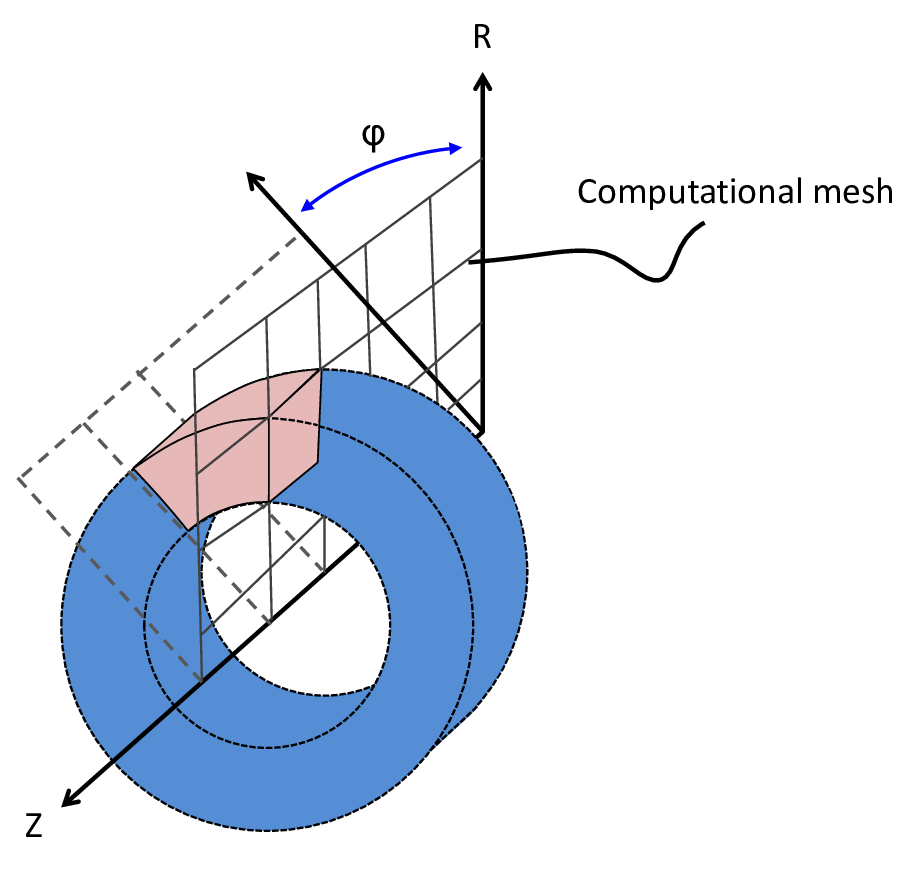
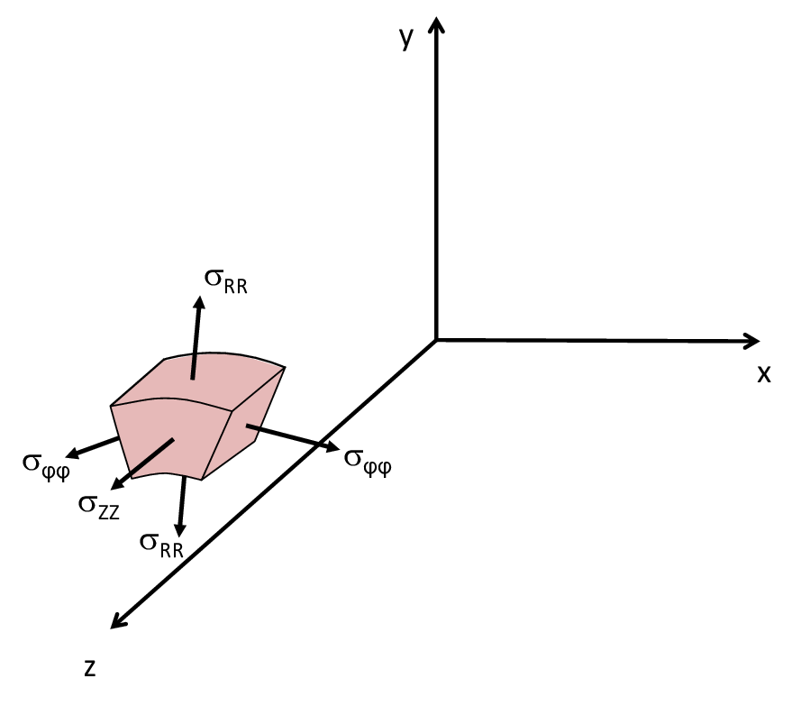
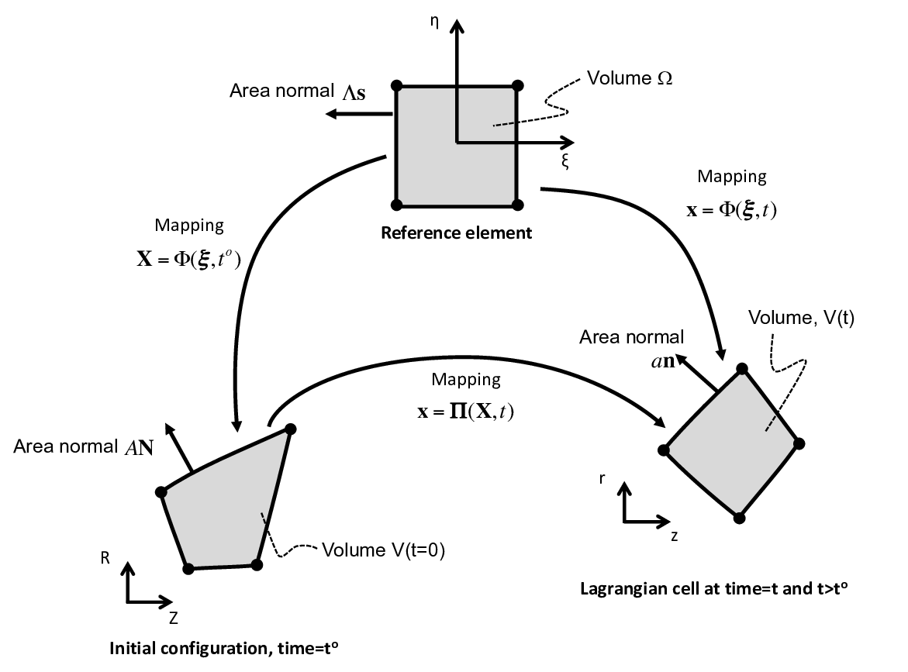

# SGH-RZ Solver

The SGH-RZ solver is an axisymmetric Lagrangian hydrodynamic method designed for 2D axisymmetric coordinates $(z, r, \varphi)$. It conserves mass and total energy and preserves symmetry on 1D radial flows using equal angle polar meshes.

## Governing Equations

Even though the simulation is performed using a 2D mesh, the simulation corresponds to a 3D problem that is axisymmetric. The axisymmetric approximation applies to cases with:

$$
\frac{\partial \rho^{3D}} {\partial \varphi} = 0, \quad \frac{\partial {\mathbf v}^{3D}} {\partial \varphi} = 0, \quad \text{and} \quad \frac{\partial e^{3D}} {\partial \varphi} = 0
$$

The superscript 3D will be used to differentiate a variable from one that is purely planar. The axisymmetric approximation reduces a 3D system $(z,r,\varphi)$ to a 2D solve $(z,r)$.

Using this approximation, the velocity and stress (Figure below) become:

$$
{\mathbf v}^{3D} = 
\begin{bmatrix} 
v_z & v_r & v_\varphi 
\end{bmatrix}^T 
= 
\begin{bmatrix} 
v_z & v_r & 0 
\end{bmatrix}^T
$$

$$
{\boldsymbol{\sigma}}^{3D} = 
\begin{bmatrix} 
\sigma_{zz} & \sigma_{zr} & \sigma_{z\varphi} \\
\sigma_{rz} & \sigma_{rr} & \sigma_{r\varphi} \\
\sigma_{\varphi z} & \sigma_{\varphi r} & \sigma_{\varphi \varphi} 
\end{bmatrix} 
= 
\begin{bmatrix} 
\sigma_{zz} & \sigma_{zr} & 0 \\
\sigma_{rz} & \sigma_{rr} & 0 \\
0 & 0 & \sigma_{\varphi \varphi} 
\end{bmatrix}
$$

The divergence of velocity and stress become:

$$
\nabla^{3D} \cdot {\mathbf v}^{3D} = 
\frac{\partial v_{z}}{\partial z} + \frac{1}{r} \frac{\partial}{\partial r}(r v_{r}) = 
\frac{\partial v_{z}}{\partial z} + \frac{\partial v_{r}}{\partial r}+ \frac{v_{r}}{r}
$$

$$
\nabla^{3D} \cdot {\boldsymbol \sigma}^{3D} = 
\begin{bmatrix} 
\frac{\partial \sigma_{zz}}{\partial z} + \frac{1}{r} \frac{\partial}{\partial r}(r\sigma_{rz}) \\
\frac{\partial \sigma_{zr}}{\partial z} + \frac{1}{r} \frac{\partial}{\partial r}(r\sigma_{rr}) - \frac{\sigma_{\varphi\varphi}}{r} \\
0 
\end{bmatrix} 
= 
\begin{bmatrix} 
\frac{\partial \sigma_{zz}}{\partial z} + \frac{\partial \sigma_{rz}}{\partial r} + \frac{\sigma_{rz}}{r} \\
\frac{\partial \sigma_{zr}}{\partial z} + \frac{\partial \sigma_{rr}}{\partial r} + \frac{\sigma_{rr} - \sigma_{\varphi\varphi}}{r} \\
0 
\end{bmatrix}
$$

The velocity gradient is

$$
{\mathbf {L}} = 
\nabla^{3D} {\mathbf v}^{3D} = 
\begin{bmatrix} 
\frac{\partial v_z}{\partial z} & \frac{\partial v_z}{\partial r} & 0 \\
\frac{\partial v_r}{\partial z} & \frac{\partial v_r}{\partial r} & 0 \\
0 & 0 & \frac{v_r}{r} 
\end{bmatrix}
$$

The governing physics equations can be written as 2D equations with a source term.
The divergence and gradients can be expressed as:

$$
\nabla^{3D} \cdot {\mathbf v}^{3D} = \nabla \cdot {\mathbf v} + \frac{v_{r}}{r}
$$

$$
\nabla^{3D} \cdot {\boldsymbol \sigma}^{3D} = 
\nabla \cdot {\boldsymbol\sigma} 
+ 
\begin{bmatrix} 
\frac{\sigma_{rz}}{r} \\
\frac{\sigma_{rr}-\sigma_{\varphi\varphi}}{r} 
\end{bmatrix}
$$

$$
\nabla^{3D} {\mathbf v}^{3D} = 
\nabla {\mathbf v} + 
\begin{bmatrix} 
0 & 0 & 0 \\
0 & 0 & 0 \\
0 & 0 & \frac{v_r}{r} 
\end{bmatrix}
$$

The velocity evolution equation can be expressed as:

$$
\rho^{3D} \frac{d{\mathbf v} }{dt} = 
\nabla \cdot {\boldsymbol \sigma} 
+ 
\begin{bmatrix} 
\frac{\sigma_{rz}}{r} \\
\frac{\sigma_{rr}-\sigma_{\varphi\varphi}}{r} 
\end{bmatrix}
$$

Likewise, the specific internal energy equation is:

$$
\rho^{3D} \frac{d e^{3D}}{dt} = \left( \nabla {\mathbf v} \right): {\boldsymbol \sigma} + \frac{\sigma_{\varphi\varphi} v_{r} }{r}
$$

The reader is reminded that there is no variation in the azimuthal direction and the omission of a superscript $3D$ means it is a $2D$ operator or variable in the $(z,r)$ coordinates. The specific kinetic energy evolution equation can be recovered by multiplying velocity evolution equation by the velocity vector,

$$
\rho^{3D} \frac{d k }{dt} = 
(\nabla \cdot {\boldsymbol \sigma}) \cdot \mathbf v 
+ \frac{\sigma_{rz} v_{z} + \sigma_{rr} v_{r} - \sigma_{\varphi\varphi} v_{r}}{r}
$$

The specific total energy evolution equation is

$$
\rho^{3D} \frac{d \tau }{dt} = 
\nabla \cdot ( {\boldsymbol \sigma} \cdot \mathbf v) 
+ \frac{\sigma_{rz} v_{z} + \sigma_{rr} v_{r}}{r}
$$

The derivation of the governing physics equations in axisymmetric coordinates is complete.

## Numerical Methods

The discussion that follows here will focus on a novel numerical formulation to solve a subset of the governing equations presented in this section for an arbitrary number of materials in an element.

### Mass Conservation
The density for each material is calculated using strong mass conservation.

$$
\rho^m_h = \frac{m^m_h}{V^m_h}
$$

where $V^m_h = \theta^m_h \beta_h^m V^{3D}_h$.

### Momentum Evolution
The Petrov-Galerkin approach is used with a specific test function $\eta_q = \phi_q \frac{r_q}{r}$ to preserve symmetry:

$$
\sum \limits_{h \ni q} \sum \limits_{m \in h} \int \limits_{V_h} \eta_q \rho^m_h \frac{d \mathbf{v}_h}{dt} \beta_h^m \theta_h^m dV = \sum \limits_{h \ni q} \sum \limits_{m \in h} \int \limits_{V_h} \eta_q \nabla \cdot (\boldsymbol{\sigma}_h^m + \mathbf{Q}_h^m) \beta_h^m \theta_h^m dV
$$

### Specific Internal Energy Evolution
The specific internal energy evolution equation guarantees total energy conservation (compatible discretization). The change in specific internal energy for an element is given by:

$$
{e}_h^{m,\, n+1} = {e}_h^{m,\, n} - \frac{\Delta t}{m^m_h} \sum \limits_{p \in h} \left( { \mathbf{F}^{m, \,n+1/2}_{hp}}\cdot \frac{1}{2}\left(\mathbf{v}_p^{n+1} + \mathbf{v}_p^{n} \right) \right)
$$

### Geometry
Position and velocity fields are defined in terms of Lagrangian basis functions in 2D:

$$
\mathbf{x}_h({\boldsymbol \xi},t) = \sum \limits_{p \in h} {\phi}_p \left( {\boldsymbol \xi} \right) \cdot \mathbf{x}_p \left( t \right)
$$

$$
\mathbf{v}_h({\boldsymbol \xi},t) = \sum \limits_{p \in h} {\phi}_p \left( {\boldsymbol \xi} \right) \cdot \mathbf{v}_p \left( t \right)
$$

### Time Integration
The discrete change in velocity is calculated using a two-step Runge-Kutta time integration method:
1.  Calculate intermediate velocity $\mathbf{v}_p^{n+1/2}$.
2.  Calculate final velocity $\mathbf{v}_p^{n+1}$.

### Artificial Viscosity
A tensoral dissipation term $\mathbf{Q}^m_h$ is included for stability on shock problems, calculated using a multi-directional approximate Riemann solver (MARS).

## Implementation Details
-   **Element Type:** Single quadrature point quadrilateral element in 2D representing a revolved volume.
-   **Mass Lumping:** Conservative and consistent partitioning of element area to corners.
-   **Material Handling:** Supports arbitrary number of materials per element with volume fractions $\theta^m_h$ and material fractions $\beta_h^m$.
