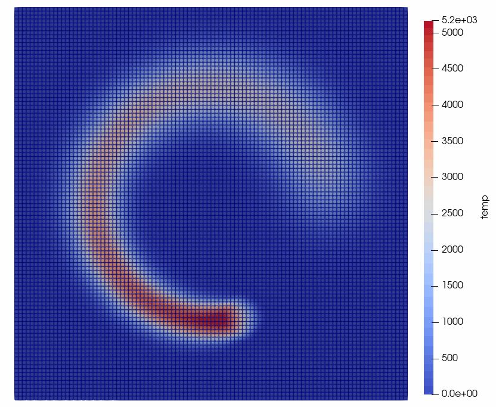

# Staggered Grid Thermo Mechanical Solver (SGTM)

The SGTM solver is a transient thermal solver designed to simulate evolving temperature fields in additive manufacturing (AM) and welding processes, where a moving energy source induces large thermal loads.

## Governing Equations

The solver addresses the heat transfer equation:
$$
\rho c_p \frac{\partial T}{\partial t} = - \nabla \cdot (k \nabla T) + Q_{in}
$$
where $Q_{in}$ is the volumetric heat source term.

The thermal stress is calculated as:
$$
\boldsymbol{\sigma}_h = E\alpha \left( T_h - T^0 \right)\textbf{I}
$$
where $E$ is the Young's modulus, $\alpha$ is the thermal expansion coefficient, $T_h$ is the element temperature, and $T^0$ is a reference temperature.

## Numerical Methods

### Thermal Evolution
A finite volume-like approach is used to evolve nodal temperatures, employing finite element basis functions for gradients.
$$
T_p^{n+1} = T_p^{n} + \frac{\Delta t}{m_{p}c_{p}} \left( \sum_{h \in p} \textbf{N}_{hp} \cdot \textbf{q}_h^{n+1/2} + \sum_{h \in p} \frac{1}{8} \int \limits_{V_{h}}{Q}^{n+1/2}_{h, \, in}\, dV - \bigg|\bigg|\sum_{i \in p} \textbf{N}_{ip}\bigg|\bigg| \, q_i^{n+1/2} \right)
$$

### Heat Flux
The heat flux at the element center is calculated as:
$$
\textbf{q}_h = -k_h\nabla T_h
$$

### Boundary Conditions
The solver supports convection and radiation heat transfer on the boundaries:
-   **Convection:** $q_i^{conv} = -h(T_p - T_{\infty})$
-   **Radiation:** $q_i^{rad} = \epsilon \sigma (T_{c}^4 - T_{\infty}^4)$

### Time Integration
Nodal temperatures are advanced using a second-order Runge-Kutta integration scheme.

## Results

*Example: Transient thermal simulation of a moving Gaussian heat source.*

## Implementation Details
-   **Element Type:** Linear hexahedral elements.
-   **Material Handling:** Formulated as a two-material problem (air and metal) for AM processes.
-   **Coupling:** Can be coupled with static mechanical finite element solvers for thermal distortion analysis.
