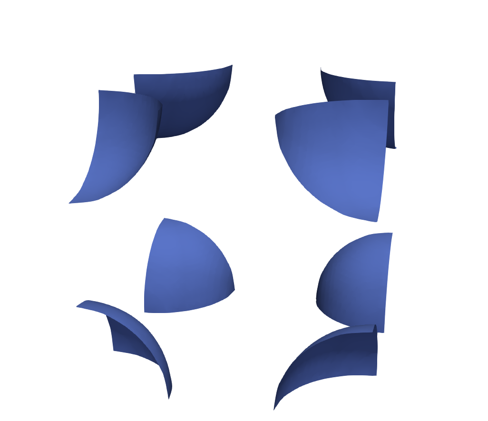

# Level Set Solver

The Level Set Solver is designed to model dynamically evolving fronts, such as interfaces or phase boundaries, on unstructured meshes. It evolves the level set function $\phi$, where $\phi=0$ represents the front.

## Governing Equation

The level set evolution equation is:

$$
\frac{\partial \phi}{\partial t} + H(\nabla \phi, \mathbf{x}) = 0
$$

where the Hamiltonian $H(\nabla \phi, \mathbf{x}) = v_n ||\nabla \phi||$ and $v_n$ is the normal velocity magnitude.

## Numerical Methods

### Discretization
A finite difference approach is used on unstructured meshes. The upwind value of $H(\nabla \phi, \mathbf{x})$ is calculated using corner weights $\gamma_{hp}$:

$$
H_{+h} = \frac{\sum \limits_{hp \in h} (\gamma_{hp} \mathbf{v}_{hp} \cdot \nabla \phi_p)}{\sum \limits_{hp \in h} \gamma_{hp}}
$$

where the subscript $+$ denotes the upwind direction relative to element $h$.

### Nodal Gradient
Nodal gradients are calculated using the central difference method:

$$
\nabla \phi_p = -\frac{1}{V_p} \sum \limits_{hp \in p} \mathbf{N}_{hp} \phi_{g(h)}
$$

where $\mathbf{N}_{hp}$ is the corner normal.

### Corner Weights
Corner weights $\gamma_{hp}$ are calculated based on the dot product of the corner velocity and the element corner unit normal:

$$
\gamma_{hp} = \max\left(0, -\frac{\mathbf{v}_{hp}}{||\mathbf{v}_{hp}||} \cdot \mathbf{n}_{hp}\right)
$$

This ensures stable upwinding.

### Time Integration
The level set equation is integrated forward in time using a multi-stage Runge-Kutta method (e.g., two-stage).

## Results

*Example: Four interfaces propagating radially outward and colliding.*

## Implementation Details
-   **Element Type:** Unstructured hexahedral meshes.
-   **Field Location:** Level set field at element centers (Gauss points), gradients at nodes.
-   **Material Handling:** Evolves level set field within regions containing specified materials.
