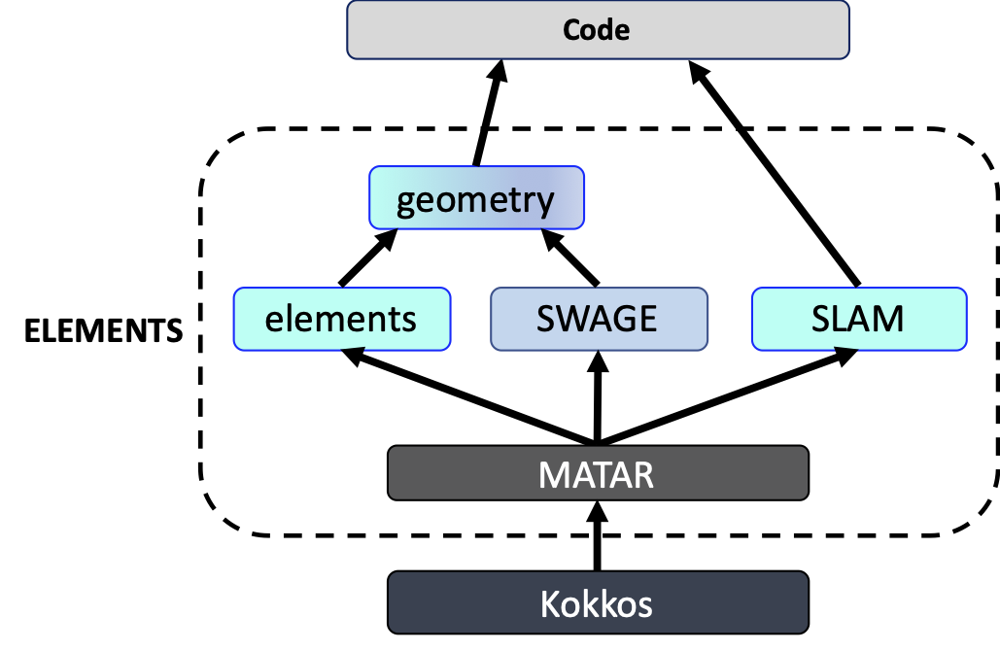

.. ELEMENTS documentation master file, created by
   sphinx-quickstart on Thu Jan  6 15:03:29 2022.
   You can adapt this file completely to your liking, but it should at least
   contain the root `toctree` directive.

ELEMENTS documentation
======================
The **ELEMENTS** library, written in C++, is a collection of sub-libraries that support the implementation of a diverse range of numerical methods on low and high-order meshes.  
The **ELEMENTS** library can be used for research and development of both continuous and discontinuous finite element methods, as well as finite volume methods to solve a diverse range of partial differential equations.

The **ELEMENTS** library includes the following sub-libraries:  

 * :ref:`MATAR` contains the routines to support dense and sparse **mat**\ rices and **ar**\ rays; 
 * :ref:`SLAM` contains the interfaces to **s**\ olvers, **l**\ inear **a**\ lgebra, and **m**\ athematical routines or external packages (e.g., Trilinos);  
 * :ref:`elements` contains the mathematical functions to support a large range of elements types including serendipity elements;
 * :ref:`SWAGE` contains the routines and data-structures to support unstructured arbitrary-order 3D meshes that move or remain stationary; and 
 * :ref:`geometry` combines together **SWAGE** and **elements**.

The **ELEMENTS** libary is designed to support Lagrangian (mesh moves) solid dynamics and mechanics codes, Eulerian (mesh is stationary) fluid dynamics codes, and many other code applications.  

   Code layout

.. figure:: ../images/TaylorGreenVortex-t0.png

   Lagrangian mesh

.. figure:: ../images/TaylorGreenVortex-tEnd.png

   Lagrangian mesh deformed with Taylor-Green vortex

.. toctree::
   :maxdepth: 1
   :caption: Contents:

   how_to_install
   how_to_use
   elements
   geometry
   matar
   slam
   swage
   examples
   how_to_document

Indices and tables
==================

* :ref:`genindex`
* :ref:`modindex`
* :ref:`search`
